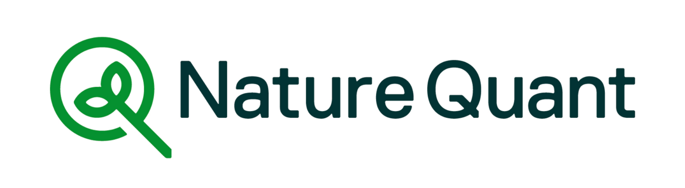
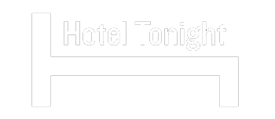

# Quarantine Winning

---

@snap[north span-100]

### Who am I (Chris Bailey)?

@snapend

- 20+ years remote software dev
- Remote for variety of companies
- In multiple US cities & Berlin
- Love espresso, mtb, skiing, running, climbing.
- Wife & two kids

@snap[south span-100]

## @snapend

---

@fa[quote-left](You are not working from home, you are at home during a crisis trying to work.)

---

@snap[north span-100]

## If only one thing...

@snapend

#### Consider a lot of ideas, but...

#### figure out what works for you,

#### just like a diet.

@snap[south span-90]
WFH articles are great sources of ideas, but absolutely not authoritative.
@snapend

---

## Discuss & Coordinate with your SO

#### ...and your kids (if applicable)

- Set expectations
- How to signal do not disturb

---

@snap[north span-100]

## Work won't be (as much of) a social outlet

@snapend

@snap[west span-50 text-center]
Find other - sports, meetups, coffees, etc.
@snapend

@snap[east span-48 text-center]
But realize you also get time back\*
@snapend

@snap[south span-100]
Get time back, as you spend less time being interrupted or spending time on "non-work" social/chit-chat, etc., leaves more time in day to do what you want _outside of work_.
@snapend

---

@snap[north span-100]

## Dont scrimp on your office

@snapend

1. High end chair
2. "Standing" desk (for precise height)

@snap[south span-100]

https://autonomous.ai or take your chair home
@snapend

---

## Transition

No more commute = no more easy transition.

Do something to explicitly help transition. Take notes if in the middle of something.

---

## Take breaks, change up the scenery

- Easier to get/stay in the zone/flow at home
- Read outside or on your couch
- Go for a walk

---

## Use video!

- Nuance and human contact are significantly improved.
- Subtle, but valuable benefits

@snap[south span-100]
Also, stay muted unless you're talking.
@snapend

---

@snap[north span-100]

## Notifications

@snapend

- Hard balance between showing folks you're there, and not being constantly interrupted
- Turn off email & nearly all phone notifications
- Batch email
- Slack: only notify for @ mentions, threads
- Beware of setting an expectation that you're _always_ available
- Use the right communication medium

---

## My Struggle

- Still find it hard to leave mid-afternoon.
- I prefer to exercise in the afternoon, but I am always happier when I do it in the morning, and then can work the rest of the day.
- People notice less if show up late (11am, noon?)

---

@snap[north span-100]

## Contact Me?

@snapend

Slack

@chrisrbailey

chris.bailey@gmail.com

@snap[south span-100]
Latest tech/work: serverless, Go, geospatial, GIS, PostGIS, NatureQuant™ (my new biz)
@snapend
